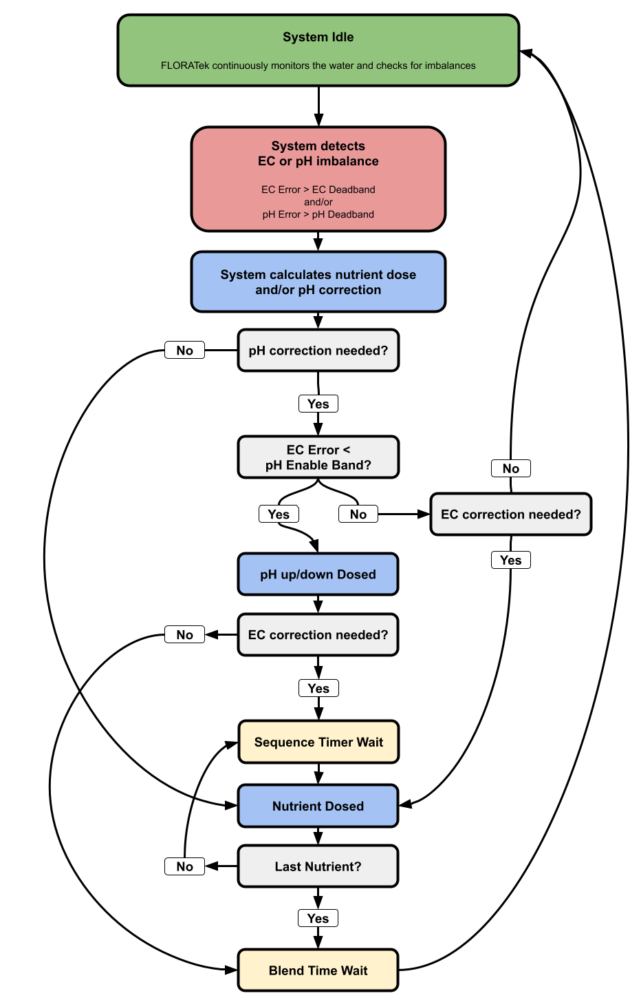

How FLORATek Works
==================

The FLORATek control system is designed to monitor and react to your water conditions in real-time. It continuously measures the pH, nutrient levels (EC), and temperature of your water, and automatically adds pH solutions and nutrients as needed to keep your water balanced and healthy for your plants. This process, which we call the Dose Cycle, is explained in detail in this section.

The Dose Cycle
----------------

At first glance, the dose cycle may seem complicated and confusing, but it has been carefully designed to automatically provide pH and EC corrections in the most efficient way possible. 

Many of the variables that interact with the dose cycle are set in the menu, but the basic flow will always remain unchanged. 

When the user pushes the RUN button, the control will enter the dose cycle. It will either immediately enter the idle mode, or begin dosing if the EC and/or pH are out of balance. 

Control States
----------------

The FLORATek control will always be in one of 4 states when in the run mode: Idle, Dosing, Sequence Waiting, or Blend Time Waiting. 

Idle
~~~~~~~~~~

The control will be in the idle state when the pH and EC levels of your water are within the acceptable range of your setpoints. This range is set by the EC and pH deadband variables. Higher deadband values will result in less frequent dosing, while lower deadband values will result in more frequent dosing. 

Dosing and Sequence Waiting
~~~~~~~~~~

Immediately upon detecting a pH or EC imbalance, the control will calculate the most effective dose (or doses) to correct the imbalance and enter the dosing state. If the EC is significantly out of range, pH dosing will be disabled until the EC is within the pH Enable Band. It may take 2 or 3 dose cycles for the EC rise to within the pH Enable Band. 

If a particular dose cycle requires more than one dose, the control will enter the sequence waiting state in between every dose. In this state, the control is waiting for the first dose to finish and for the water to be mixed before pumping the next dose. For example, some nutrients within nutrient solutions can bind together if they come in contact without first being mixed into the water. 

Blend Time Waiting
~~~~~~~~~~

Once all doses in a dose cycle have been added, the control will enter the blend time waiting state. In this state, the control is waiting for the water to be thoroughly mixed before it takes another measurement and begins the next dose cycle. 

If the blend time is set too low, the control will quickly overshoot your setpoints. If this number is too high, the control will take an excessively long amount of time to reach your setpoints. Always start with a blend time higher than you believe is appropriate! It is much safer for your plants if the control slowly reaches your setpoints compared to if the control overshoots your setpoints. The blend time can be tweaked as you learn how "fast" or "slow" your hydroponic system reacts to doses being added.
